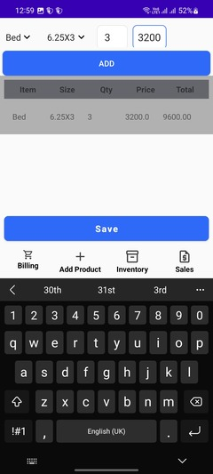
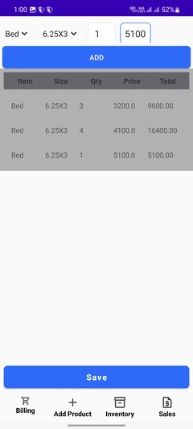
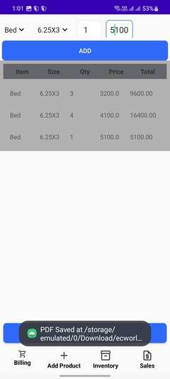
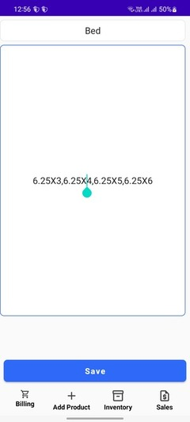
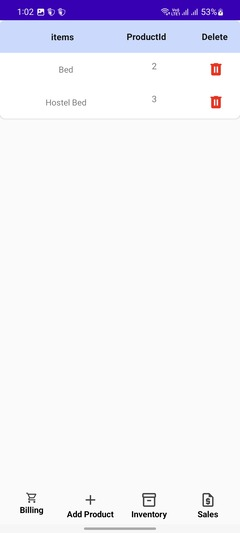

# **Mobile Billing App**

## **Project Description**

The **Mobile Billing App** is a lightweight solution for small businesses and users who need a simple and efficient way to generate bills without a computer. This app provides functionalities to manage products, create bills, and track sales history.

This project demonstrates expertise in **Kotlin**, **Firestore**, **RecyclerView**, **PDF generation**, and **Android development**. It highlights a structured and modular approach to building robust mobile applications.

---

## **Features**

### **Product Management**
- **Add Products**: Enter product details, including name and variations (e.g., `6X3`, `6X4`), using a comma-separated input. Variations are stored as individual options.
- **Delete Products**: Remove products from Firestore directly from the app. *(Editing products will be implemented in the future.)*

### **Billing**
- **Dynamic Drop-Down Menus**:
  - Select a product from the first drop-down menu.
  - Automatically update the second drop-down with product variations.
- **Bill Creation**:
  - Enter quantity and price for each item and add it to the bill.
  - Generate a detailed PDF containing all items, their quantities, prices, and totals.
  - Save the generated PDF in a dedicated folder for easy access.
  - Input client name and mobile number (optional) before generating the PDF.

### **Sales History**
- **Sales Tracking**:
  - List all generated bills by fetching all PDF files from the folder.
  - Easily access previous bills and review sales.

---
### **Pages**
- **Billing Page**:
  - add items to bill
  - add client name mobile number(optional) to bill
  - generate bill
    
    
    
    
    

- **Add Product Page**:
  - add products
    
  
- **Inventory Page**:
  - list products 
  - delete projects
  - edit project (needs to implement later)
    
  
- **Sales Page**:
  - list all bills generated
    

---

## **Technology Stack**
- **Programming Language**: Kotlin
- **Backend**: Firebase Firestore
- **UI Components**: RecyclerView, Drop-Down Menus, Dialogs
- **File Handling**: PDF generation and folder management
- **Architecture**: MVVM pattern
- **Libraries**:
  - Firebase Firestore SDK
  - AndroidX Components
  - iText or similar library for PDF generation

---

**Bill Sample Picture**

## **Project Structure**
The project is organized for modularity and scalability:

